- GIS & Web developer with Environment and Climate Change Canada :maple_leaf::floppy_disk:
- Technical lead for the [Reusable Accessible Mapping Platform](https://github.com/ramp4-pcar4/ramp4-pcar4) :world_map::mage_man:
- Big Cheese at [Grousewood Games](https://github.com/grousewood-games) :deciduous_tree::bug:
- Programming stuff I ...
  - currently use professionally: [Typescript](https://www.typescriptlang.org/) | [ArcGIS SDK for Javascript](https://developers.arcgis.com/javascript/latest/) | [ArcServer REST API](https://developers.arcgis.com/rest/)
  - dabble in: [SolidJS](https://www.solidjs.com/) | [Vue](https://vuejs.org/) | [Vite](https://vite.dev/) | [CSS](https://www.w3.org/Style/CSS/Overview.en.html) | [Three.js](https://threejs.org/)
  - used to use professionally: [Visual Basic 5](https://en.wikipedia.org/wiki/Visual_Basic_(classic)) | [Visual Basic .Net](https://learn.microsoft.com/en-ca/dotnet/visual-basic/) | [SQL Server](https://www.microsoft.com/en-ca/sql-server)

 
                     

Profile pic - "There Is No End" by [Andy Kehoe](https://andykehoe.art/)